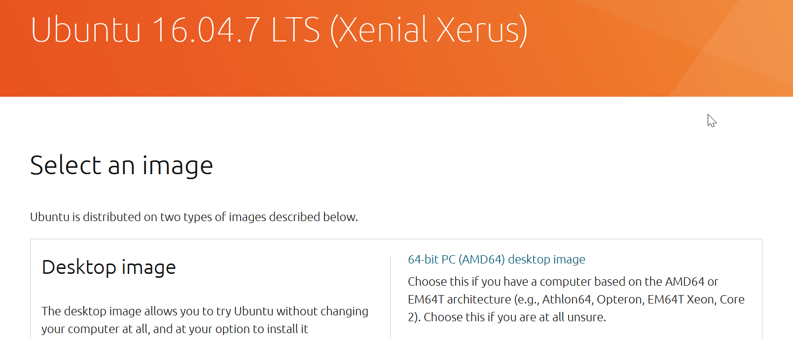
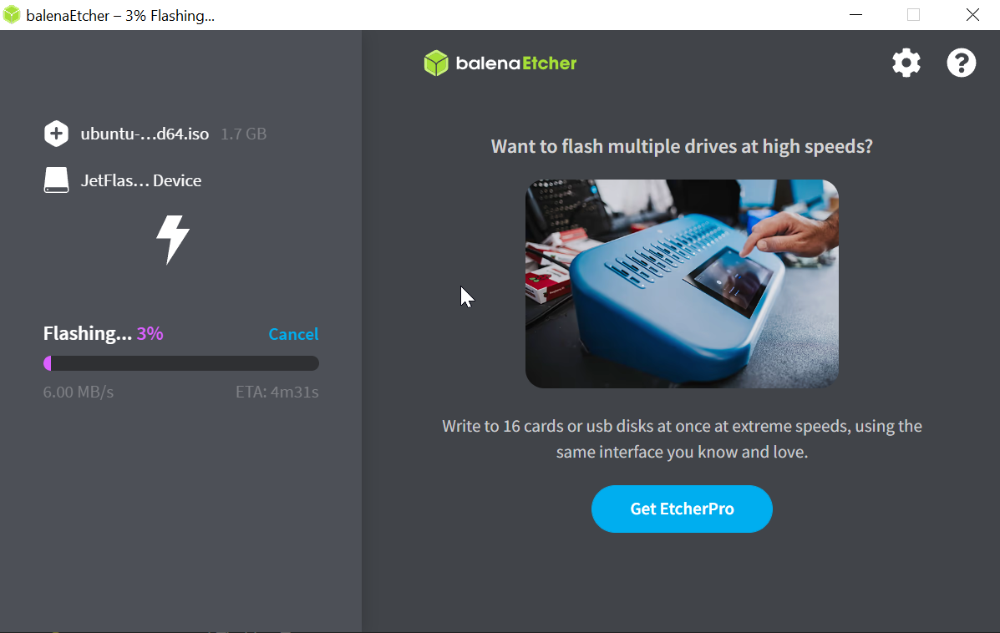

# Setup Protocol V2

As requested, we are attempting to install the Pepper SDK according to the [QI SDK Tutorial](https://android.aldebaran.com/sdk/doc/pepper-sdk/ch1_gettingstarted/installation.html#installation) Tutorial.

1. First I downloaded [Ubuntu 16.04.7 LTS (Xenial Xerus) (64 bit) ISO](https://releases.ubuntu.com/16.04/) and flashed it onto my USB-Stick with [Balena Etcher](https://etcher.balena.io/).






2. I plugged it into the PC and went through the basic Ubuntu install. No screenshot is provided as there is nothing worthwhile adding. We had some starting issues since the grub loader couldn't be found, but we managed to fix that.

3. I ran
```shell
sudo apt update && sudo apt upgrade
```
to update all of the applications.

4. I installed Java 1.8.0.292

5. I installed [Android Studio Giraffe 2022.3.1 Patch 3](https://developer.android.com/studio) and executed the studio.sh to finish the installation.

6. I then set the API version to the latest stable (API 34)


7. I also set the right SDK-Build Tools


8. I also made sure that Virtualisation is enabled.

9. I made sure Bonjour is installed (it always is on linux)

10. I attempted to install the Pepper SDK from the marketplace, it's been taken down tho so I took the latest marketplace version. Then I was alerted that The pepper sdk is not compatible with the current verion of my android sdk

After talking to the teacher I was instructed to use the Android Studio Flamingo | 2022.2.1 Patch 2 Version. 

Sadly this version apperently also has compatibility issues.

11. I tried it anyway and ran into problems with the package not being recognized.